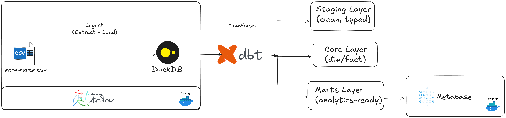
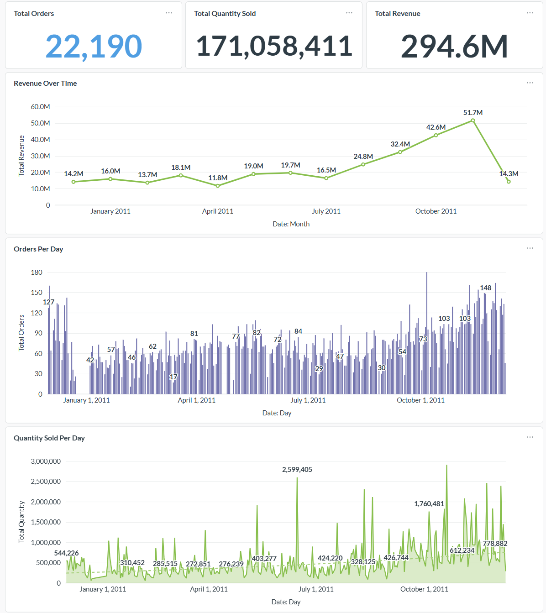
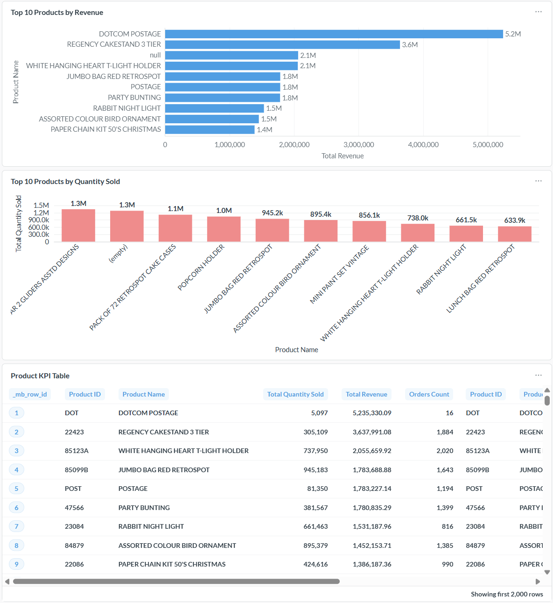
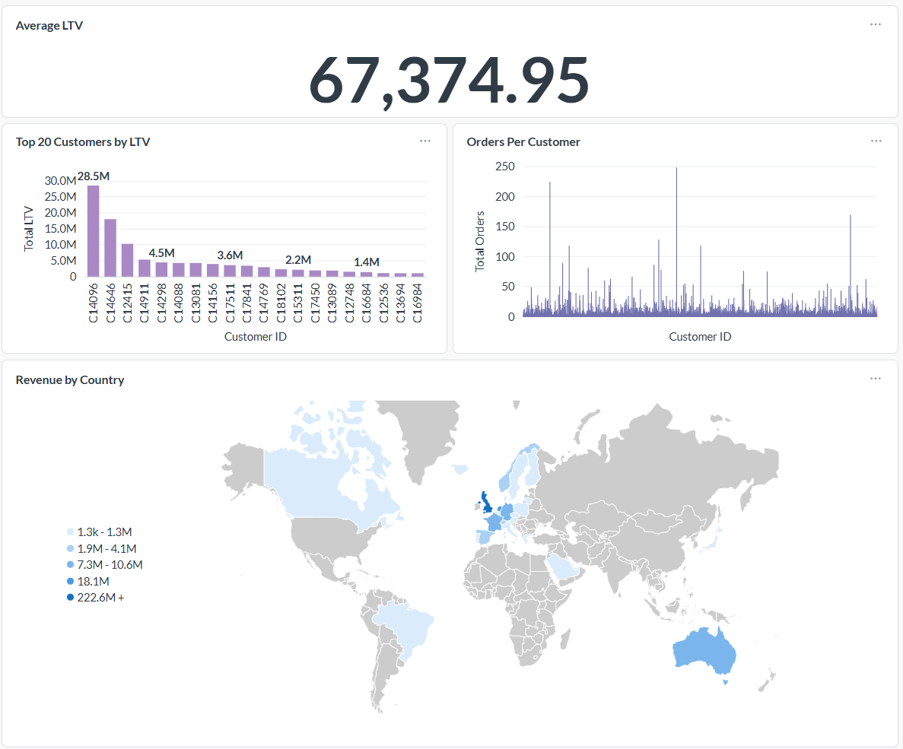

# Modern ELT Data Warehouse (Airflow + dbt + DuckDB)


This project implements a **modern ELT data warehouse** for an e-commerce use case using:

- **Apache Airflow** for orchestration & scheduling  
- **dbt** for modular SQL transformations and data modeling  
- **DuckDB** as the analytical warehouse  
- **Metabase** for BI dashboards  

---

## 📌 Business Context

An e-commerce business collects transactional data related to:

- Customers  
- Products  
- Orders  
- Order Items  

The goal of this project is to build a complete **ELT pipeline**:

1. Ingest raw transaction data into DuckDB  
2. Build staging models for cleaning & standardization  
3. Build dimensional models (facts & dimensions)  
4. Build data marts for analytics  
5. Orchestrate the entire pipeline using Apache Airflow  


## Dataset

The dataset is a single transactional CSV file containing order line items:

InvoiceNo, StockCode, Description, Quantity, InvoiceDate, UnitPrice, CustomerID, Country


- `Example row:`
``
536365,85123A,WHITE HANGING HEART T-LIGHT HOLDER,6,12/1/2010 8:26,2.55,17850,United Kingdom
``

Each row = one item purchased in an invoice.


## Data Modeling (Kimball)

The project follows **Kimball dimensional modeling**, including three layers:


### **1️. Staging Layer**

Standardizes raw CSV data into structured models:

- `stg_orders`
- `stg_order_items`
- `stg_products`
- `stg_customers`


### **2. Core Layer (Enterprise Dimensional Models)**

**Dimensions**
- `dim_date`
- `dim_customer`
- `dim_product`

**Fact Table**
- `fact_order_items`  
  - **Grain:** 1 row = 1 order line item  
  - Enables product analytics, revenue analysis, basket analysis, and LTV modeling  

### **3️. Mart Layer (Analytics-Ready Models)**

- `mart_daily_sales`  
- `mart_product_performance`  
- `mart_customer_ltv`  

These models are ready for BI dashboards and reporting.


## Pipeline Orchestration (Airflow)

The project includes one DAG:

- `ecommerce_elt`
```
ingest_raw
↓
[ dbt_run_staging → dbt_run_core → dbt_run_mart ]
↓
[ dbt_test_staging → dbt_test_core → dbt_test_mart ]
↓
export_marts_to_csv
```


**Features:**

- TaskGroup-based orchestration  
- Layer-dependent model execution  
- Retry logic for ingestion tasks  
- Fail-fast behavior for dbt tests  
- Daily schedule (`0 6 * * *`)  


## Folder Structure
```
ecommerce-airflow-dbt-duckdb/
├── airflow/
│ └── dags/
│ ├── ecommerce_elt_dag.py
│ 
│
├── dbt/
│ ├── models/
│ │ ├── staging/
│ │ ├── core/
│ │ └── mart/
│ ├── dbt_project.yml
│ └── profiles.yml
│
├── duckdb/
│ └── ecommerce.duckdb
│
├── data/
│ └── raw/
│ └── ecommerce.csv
│
└── README.md
```


## Architecture Diagram



## Dashboard
- Sale Overview


- Product Performance


- Customer Analytics (LTV)


## How to Run the Project


### **1. Initialize dbt**

```bash
dbt debug
dbt run
dbt test
```
### **2. Start Airflow and Metabase (Docker)**
```bash
docker compose up
```
- `Airflow UI:`
http://localhost:9000
- `Metabase UI:`
http://localhost:3000
### **3. Trigger the Pipeline**
- `Run DAG:`

ecommerce_elt_dag